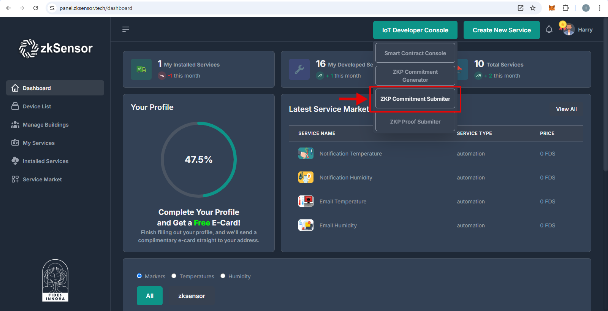

<p align="center">
  <a href="https://fidesinnova.io/" target="blank"></a>
</p>

# zk-IoT: Enabling Verifiable Computing for IoT Devices

<a href="https://www.npmjs.com/~nestjscore" target="_blank"></a>
<a href="https://www.npmjs.com/~nestjscore" target="_blank"></a>
<a href="https://www.npmjs.com/~nestjscore" target="_blank"></a>
<a href="https://circleci.com/gh/nestjs/nest" target="_blank"></a>
<a href="https://coveralls.io/github/nestjs/nest?branch=master" target="_blank"></a>
<a href="https://discord.com/invite/NQdM6JGwcs" target="_blank"></a>
<a href="https://twitter.com/FidesInnova" target="_blank"></a>

This guide will teach you how to:
- **Step A:** Create a commitment for computation from an IoT firmware and submit it to the blockchain.
- **Step B:** Execute the computation, generate a ZK proof to demonstrate the correctness of the execution, and submit it to the blockchain.
- **Step C:** Verify the ZK proof using a blockchain explorer or a verifier program.

# Table of Contents
- [zk-IoT: Enabling Verifiable Computing for IoT Devices](#zk-iot-enabling-verifiable-computing-for-iot-devices)
- [Step A. IoT Device Execution (To execute on ESP32-C3 microcontroller)](#step-a-iot-device-execution-to-execute-on-esp32-c3-microcontroller)
  - [A.1. Clone the zkIoT repository](#a1-clone-the-zkiot-repository)
  - [A.2. Writing an Arduino program](#a2-writing-an-arduino-program)
  - [A.3. Compile and generate an assembly file](#a3-compile-and-generate-an-assembly-file)
  - [A.5. Edit `device_config.json` in the zkiot folder](#a5-edit-device_configjson-in-the-zkiot-folder)
  - [A.6. Check the Commitment folder structure](#a6-check-the-commitment-folder-structure)
  - [A.7. Execute `commitmentGenerator`](#a7-execute-commitmentgenerator)
  - [A.8. Submit the commitment on blockchain](#a8-submit-the-commitment-on-blockchain)
- [Step B. Proof Generation](#step-b-proof-generation)
  - [B.1. Assemble and link the program_new, generating the ELF file](#b1-assemble-and-link-the-program_new-generating-the-elf-file)
  - [B.2. Convert the program to a binary format suitable for your IoT device](#b2-convert-the-program-to-a-binary-format-suitable-for-your-iot-device)
  - [B.3. Upload `program_new.bin` on your IoT device and execute it](#b3-upload-program_newbin-on-your-iot-device-and-execute-it)
- [Step C. Proof Verification](#step-c-proof-verification)
  - [C.1. Web ZKP Explorer](#c1-web-zkp-explorer)


# Step A. IoT Device Execution (To execute on ESP32-C3 microcontroller)
## Install Arduino Toolchain to compile C++ programs
Follow the instructions from https://docs.espressif.com/projects/arduino-esp32/en/latest/installing.html to install the Arduino ESP32 toolchain.

## A.1. Clone the zkIoT repository
```
git clone https://github.com/FidesInnova/zkiot.git
cd zkiot  
```

## A.2. Writing an Arduino program
Write an Arduino program and save it as program.ino 
```
// Example program.cpp for GCC
#include "fidesinnova.h"

void setup() {
    int result;

    asm volatile (
        "li s2, 4\n"
        "li s3, 5\n"
        "li s4, 26\n"
        "mul s2, s2, s3\n"
        "addi s2, s2, 11\n"
        "mul s2, s2, s4\n"
        "mul s2, s2, s4\n"
    );
    proofGenerator();
    return 0;
}

void loop() {
}
```

## A.3. Compile and generate an assembly file
- For ESP32-C3, compile `program.ino` using Arduino GUI to generate 'program.ino.elf'.
- Run the following command to generate the 'program.s' assembly file.
 ```
 riscv32-esp-elf-objdump.exe -d program.ino.elf > program.s
 ```

## A.5. Edit `device_config.json` in the zkiot folder
```
{
  "class": 5, // 32-bit Integer
  "iot_developer_name": "My Company", // "String"
  "iot_device_name": "Smart Device", // "String"
  "device_hardware_version": "1.0", // "String"
  "firmware_version": "1.0", // "String"
  "code_block": [26087, 26118] // "64-bit Array"
}
```
- To learn about these parameters, please refer to the [Fidesinnova Documentation](https://fidesinnova-1.gitbook.io/fidesinnova-docs/zero-knowledge-proof-zkp-scheme/1-setup-phase).

<!-- 
### Step 4. The Necessary Files
Inside the `data` folder, you will find the `setupN.json` files, where `N` corresponds to your class number. 
The `class.json` file contains critical information, including:
- **number of gates (n_g)**: The total number of gates in your ZKP.
- **number of inputs (n_i)**: The number of inputs to the ZKP.
- **n**: Calculated as `n = n_i + n_g + 1`.
- **m**: Calculated as `m = 2 * n_g`.
- **field size (p)**: The size of the finite field used in the ZKP.
- **generator (g)**: The generator of the field.

Ensure you have the correct `setupN.json` file for your class to proceed with the ZKP setup. -->

## A.6. Check the Commitment folder structure
Ensure your directory structure looks like below and contains `program.s`, `commitmentGenerator`, `class.json`, `device_config.json`, and `data/setupN.json`:
```
zkiot/|
      ├── class.json
      ├── commitmentGenerator
      ├── device_config.json
      ├── data/ |
                ├── setup1.json │
                ├── setup2.json │
                ├── setup3.json │
                └── ... (other setupN.json files)
      ├── program.cpp
      ├── program.s
      └── ... (other project files)
```
## A.7. Execute `commitmentGenerator` 
### A.7.1 Ubuntu
```
./commitmentGenerator
```
### A.7.2 macOS
```
./commitmentGeneratorForMac
```
The `commitmentGenerator` will create the following files:
- `data/program_commitment.json`: The commitment file
- `data/program_param.json`: An additional parameters file that accelerates the proof generation process.
- `program_new.s`: A newly generated assembly file with added macros.

## A.8. Submit the commitment on blockchain 
Using Fidesinnova's node web app (e.g., panel.zksensor.tech) submit the generated commitment.

### A.8.1 How to Acquire Developer Privileges
You must first obtain developer permissions to submit commitments and proofs to the blockchain using the IoT Developer Console.
<p align="center">
  
</p>
<p align="center">
  
</p>
 After clicking the 'Update' button, please notify the node admin of your email address. For example, you can send an email to info@fidesinnova.io and request to upgrade your account to an "IoT developer account".


### A.8.2. Connect your wallet to Fidesinnova's node web app.
<p align="center">
  
</p>
<p align="center">
  
</p>
<p align="center">
  
</p>
<p align="center">
  
</p>

### A.8.3. Request tokens from the faucet.
<p align="center">
  
</p>
<p align="center">
  
</p>

### A.8.4. Go to the **IoT Developer Console**
<p align="center">
  
</p>

### A.8.5. Click on **ZKP Commitment Submiter**
<p align="center">
  
</p>

### A.8.6. Click on **Upload**
<p align="center">
  
</p>
<p align="center">
  
</p>
<p align="center">
  
</p>

### A.8.7. Click on **Submit**

<p align="center">
  
</p>
<p align="center">
  
</p>

# Step B. Proof Generation
## B.1. Assemble and link the program_new, generating the ELF file
```
riscv32-esp-elf-as -o program_new.o program_new.s
riscv32-esp-elf-ld -o program_new.elf program_new.o -T esp32_out.ld
```
## B.2. Convert the program to a binary format suitable for your IoT device
```
riscv32-esp-elf-objcopy -O binary program_new.elf program_new.bin
```
## B.3. Upload `program_new.bin` on your IoT device and execute it.
Make sure your IoT device sends the generated proof to the IoT server node in order to be stored in a public database or blockchain.

# Step C. Proof Verification
## C.1. Web ZKP Explorer
Goto https://explorer.fidesinnova.io, search the submitted proof, from the menu choose "Verify Proof".

### C.1.1. Goto https://explorer.fidesinnova.io**.
<p align="center">
  
</p>

### C.1.2. On the explorer page, locate a transaction of type ZKP Stored, click on the three dots, and select "Verify Proof" from the menu.
<p align="center">
  
</p>
